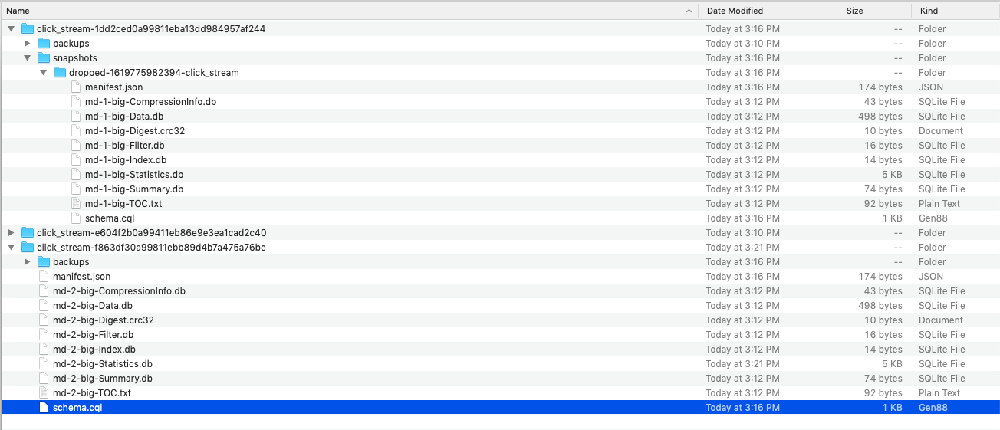

1. Start the docker compose and attach the cassandra shell (regular step)
2. Now copy the whole snapshot data into the newly created folder



3. Refresh the database - ```nodetool refresh demo click_stream```